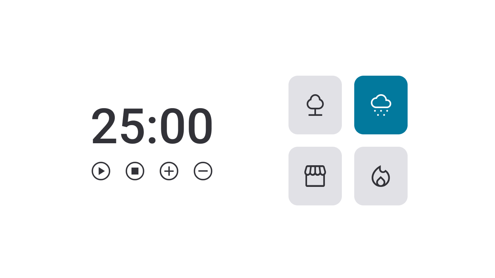

<h1 align="center"> Focus Timer - Versão 2.0 </h1>

<p align="center">
Programa promovido durante a trilha Explorer da Rocketseat para ensino de tecnologias WEB. 
</p>

- [Acesse o projeto finalizado, online](https://focus-timer-20-bernardo-sas-projects.vercel.app/)
<br><br>
<p align="center">
  <a href="#-tecnologias">Tecnologias</a>&nbsp;&nbsp;&nbsp;|&nbsp;&nbsp;&nbsp;
  <a href="#-projeto">Projeto</a>&nbsp;&nbsp;&nbsp;|&nbsp;&nbsp;&nbsp;
  <a href="#-layout">Layout</a>&nbsp;&nbsp;&nbsp;|&nbsp;&nbsp;&nbsp;
  <a href="#memo-licença">Licença</a>
</p>

<p align="center">
  
</p>

<br>

<p align="center">
  
</p>

Os botões abaixo do timer apresentam as seguintes funcionalidades: 

- ```Play```: Aciona o timer;
- ```Pause```: Pausa o timer;
- ```Stop```: Para o timer e retorna a aplicação ao estado inicial ;
- ```+```: Acrescenta 5 minutos ao tempo do timer;
- ```-```: Diminui 5 minutos do tempo do timer; 
- ```Seleção de sons ambientes:``` Nos cards à direita do relógio, foi adicionada a funcionalidade de selecionar diferentes sons de fundo (floresta, chuva, cafeteria e fogueira) para criar um ambiente propício à concentração.

## 🚀 Tecnologias

Esse projeto foi desenvolvido com as seguintes tecnologias:

- HTML
- CSS
- JavaScript
- Figma


## 💻 Projeto


- <p align="center">A aplicação consiste em um temporizador ao estilo Pomodoro, para auxílio ao usuário principalmente no foco ao estudar.  <br/><br/></p>


## 🔖 Layout

Você pode visualizar o layout do projeto através [DESSE LINK](https://www.figma.com/file/Pw8yMsK7HFkD6aISZt6gPA/Stage-05---Focus-Timer-2.0/duplicate). É necessário ter conta no [Figma](https://figma.com) para acessá-lo.

## :memo: Licença

Esse projeto está sob a licença MIT.

---

Feito por Bernardo Sá :wave: [Participe da comunidade da Rocketseat!](https://discord.gg/rocketseat)