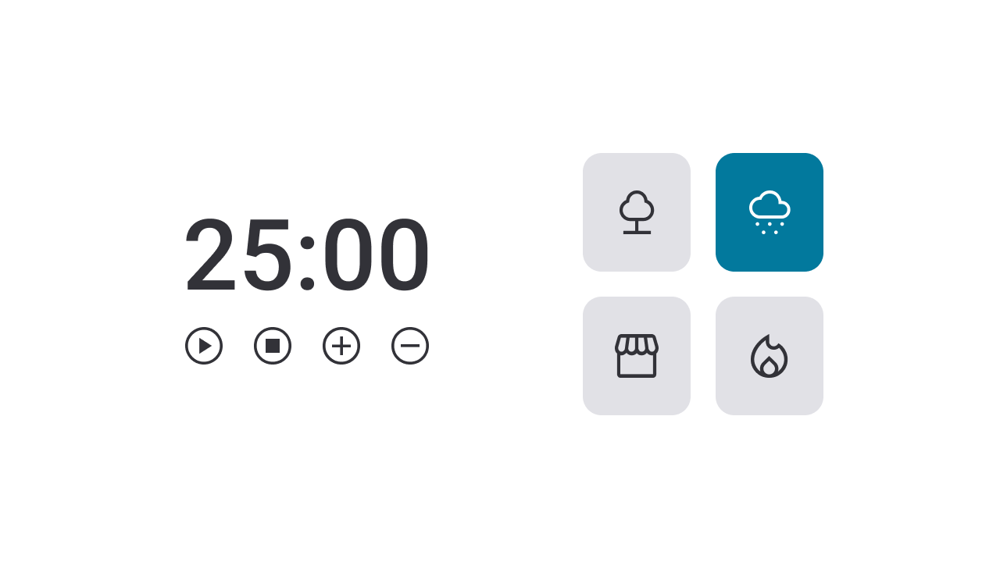

<h1 align="center"> Focus Timer - Versão 2.0 </h1>

Programa desenvolvido durante a trilha Explorer da Rocketseat, com foco no aprimoramento das bases de HTML, CSS e JavaScript.. 

- [Acesse o projeto finalizado, online](https://focus-timer-20-bernardo-sas-projects.vercel.app/)
  

  <a href="#-tecnologias">Tecnologias</a>&nbsp;&nbsp;&nbsp;|&nbsp;&nbsp;&nbsp;
  <a href="#-projeto">Projeto</a>&nbsp;&nbsp;&nbsp;|&nbsp;&nbsp;&nbsp;
  <a href="#-funcionalidades">Funcionalidades</a>&nbsp;&nbsp;&nbsp;|&nbsp;&nbsp;&nbsp;
  <a href="#-layout">Layout</a>&nbsp;&nbsp;&nbsp;|&nbsp;&nbsp;&nbsp;
  <a href="#memo-licença">Licença</a>

  

 

  

## 🚀 Tecnologias

Esse projeto foi desenvolvido com as seguintes tecnologias:

- HTML
- CSS
- JavaScript (ES6+)
- Figma (prototipagem)

---

## 💻 Projeto

- 
O **Focus Timer 2.0** é um cronômetro inspirado na técnica Pomodoro, com o objetivo de ajudar os usuários a manterem o foco durante tarefas de estudo ou trabalho. A interface é responsiva, agradável e funcional, com a opção de adicionar sons ambientes para melhorar a concentração.    

## ✅ Funcionalidades

- `Play`: Aciona o timer;
- `Pause`: Pausa o timer;
- `Stop`: Interrompe e reseta o timer para o estado inicial;
- `+`: Adiciona 5 minutos ao timer;
- `-`: Subtrai 5 minutos do timer;
- `Sons ambientes`: Possibilidade de alternar entre Floresta 🌳, Chuva 🌧️, Cafeteria ☕ e Fogueira 🔥 para melhorar o ambiente de estudo/trabalho.

---

## 🔖 Layout

Você pode visualizar o layout do projeto através [DESSE LINK](https://www.figma.com/file/Pw8yMsK7HFkD6aISZt6gPA/Stage-05---Focus-Timer-2.0/duplicate). É necessário ter conta no [Figma](https://figma.com) para acessá-lo.

## :memo: Licença

Esse projeto está sob a licença MIT.

---

Feito por Bernardo Sá :wave: [LinkedIn](https://www.linkedin.com/in/bernardosa01)
